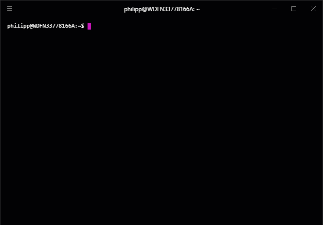

# scc_cli
A Command Line Client for the Cloud Connector as Demo of the API.

## DISCLAIMER
**This CLI tool is for demo of the SCC API only!**

**NOT READY FOR PRODUCTIVE USE!**

## Install
1. Install node and npm.
1. Open a Terminal and run `npm bin --global`. This will print the bin directory of npm. Add it to your PATH-Variable. This is OS specific, Google will help you.
1. Run `npm install --global git+https://github.com/Peter42/scc-api-demo-cli.git`

## Use
1. Open a Terminal.
1. Run `scc_cli`

Afterwards:
  - Run `config-addinstance` to configure your Cloud Connector Instance. This will create a file **scc_cli.json** in your home-directory to store your configuration.
  - If you've configured multiple Cloud Connector Instances you can run `switchinstance` to select one. Any following API calls will target the selected instance.
  - Run `help` to list all available commands.
  - ...

# License
Copyright 2018 Philipp Stehle

Licensed under the Apache License, Version 2.0 (the "License");
you may not use this file except in compliance with the License.
You may obtain a copy of the License at

http://www.apache.org/licenses/LICENSE-2.0

Unless required by applicable law or agreed to in writing, software
distributed under the License is distributed on an "AS IS" BASIS,
WITHOUT WARRANTIES OR CONDITIONS OF ANY KIND, either express or implied.
See the License for the specific language governing permissions and
limitations under the License.